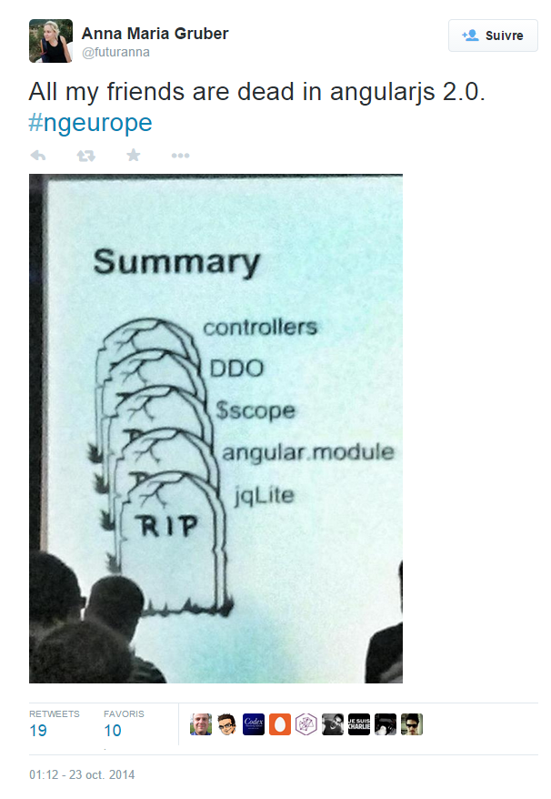
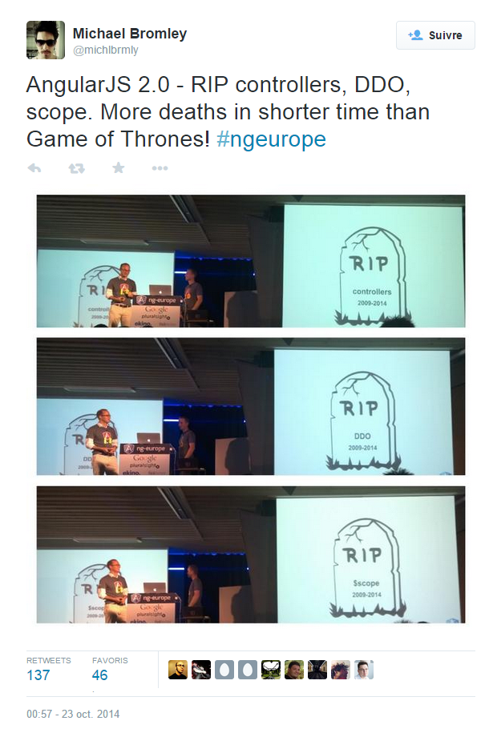
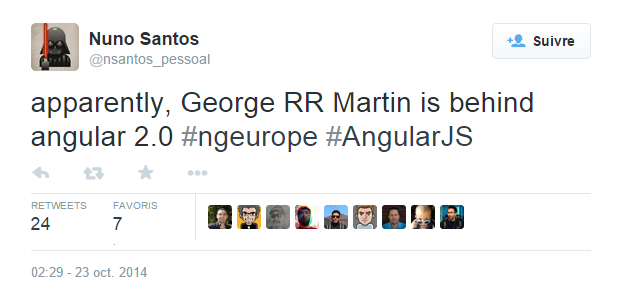
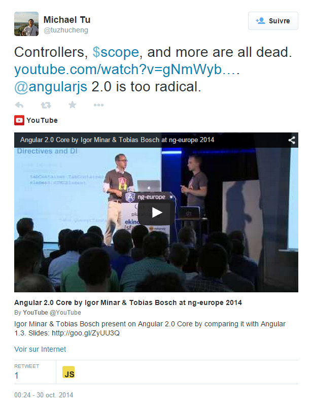
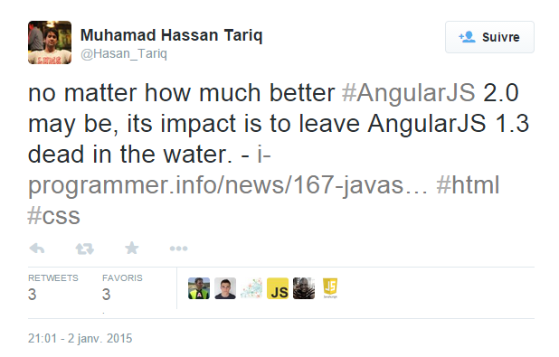
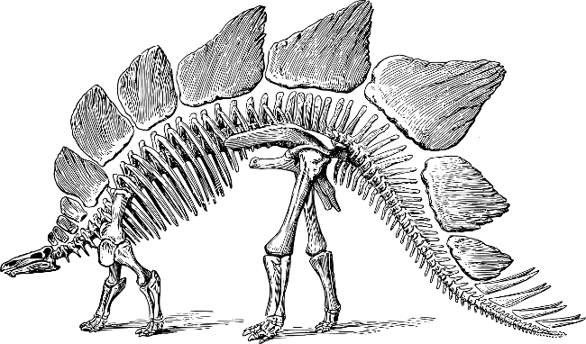
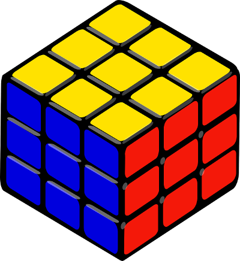
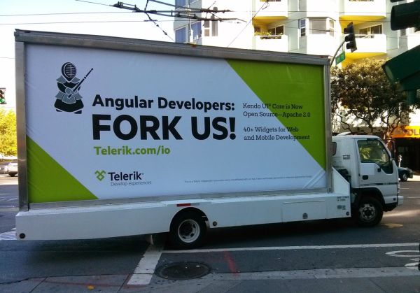
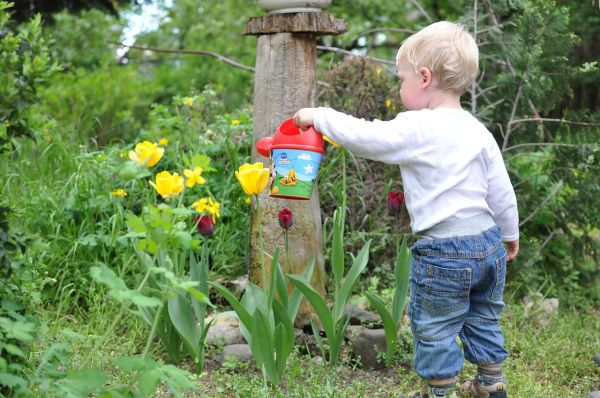

!SLIDE big ====================================================================================

## _AngularJS 2.0... et avant ?_

!SLIDE small ===========================

 

<table class="left" style="margin: 20px 0 40px 120px">
<tr>
<td></td>
<td class="biggest" nowrap>
Thierry Chatel 

&nbsp;&nbsp;&nbsp;

</td>
</tr>
</table>

### _Consultant indépendant et formateur AngularJS_

<table class="left" style="margin-left: 200px; padding: 50px">
<tr>
<tr><td></td><td>tchatel@methotic.com</td></tr>
<tr><td></td><td>@ThierryChatel</td></tr>
<tr><td></td><td>+ThierryChatel</td></tr>
<tr><td></td><td>tchatel</td></tr>
</table>

!SLIDE subsection ====================================================================================

# le drame à ngEurope

!SLIDE image ============================

!SLIDE image ============================

!SLIDE image ============================

!SLIDE image ============================

!SLIDE image ============================

!SLIDE ======================

## _Réécrire mon_
## _appli AngularJS 1.3 ?_

!SLIDE ======================

## _J’ai besoin d’un framework_
## _qui va durer 10 ans._

!SLIDE small ======================

### _“We need frameworks that are stable and supported long-term;_
### _not that are constantly inventing new concepts_
### _and being rewritten with breaking changes every 5 minutes.”_
[Danny Tuppeny](http://blog.dantup.com/2014/10/have-the-angular-team-lost-their-marbles/)

!SLIDE image ======================

# vraiment, 10 ans ?

!SLIDE ======================

### février 2005

!SLIDE ======================

### juin 2005

!SLIDE ======================

## Ajax : asynchronous JavaScript and XML

###  Jesse James Garrett
### _article du 18 février 2005_

!SLIDE bigger ============================

<table class="left" style="margin-left: 140px">
<tr>
<tr><td style="color: grey">2009</td><td style="color: grey">premier proto</td></tr>
<tr><td>2012</td><td>AngularJS 1.0</td></tr>
<tr><td>2013</td><td>AngularJS 1.2</td></tr>
<tr><td>2014</td><td>AngularJS 1.3</td></tr>
<tr><td>2015</td><td>AngularJS 1.4</td></tr>
<tr><td style="color: green">_2016 ?_</td><td style="color: green">AngularJS 2.0</td></tr>
<tr><td style="color: green">_2018 ?_</td><td style="color: green">fin du support 1.x</td></tr>
</table>

!SLIDE subsection ====================================================================================

# est-ce toujours AngularJS ?

!SLIDE bullets ============================

* plus de contrôleurs
* plus de $scope
* plus de angular.module()
* syntaxe des directives
* syntaxe des templates
* syntaxe d'injection des dépendances

!SLIDE ============================

## nouvelle implémentation
# même vision

!SLIDE subsection ====================================================================================

# pari risqué ?

!SLIDE bullets ============================

* Struts 2
* Symfony 2
* Play 2
* JSF 2
* Tapestry 5

!SLIDE ============================

## communauté perdue ?

!SLIDE ============================

## migration ?

!SLIDE subsection ====================================================================================

# pourquoi ?

!SLIDE image  ============================

# _"Designed for the future"_

!SLIDE bullets  ============================

* mobile first
* Web Components
* ECMAScript 6

!SLIDE bullets  ============================

# simplification & cohérence

!SLIDE  ============================

        @ComponentDirective
        class SantaTodoApp {
          constructor() {
            this.newTodoTitle = '';
          }
          addTodo: function() { ... }
          removeTodo: function(todo) { ... }
          todosOf: function(filter) { ... }
        }

!SLIDE small ============================

    

      <input type="text" [value]="newTodoTitle">
      <button (click)="addTodo()">+</buton>

      <tab-container>
        <tab-pane title="Good kids">
          

            <input type="checkbox"
                   [checked]="todo.done">
            {{todo.title}}
            <button (click)="deleteTodo(todo)">X</button>
          

        </tab-pane>

!SLIDE subsection ====================================================================================

# démarrer en AngularJS 1.x ?

!SLIDE ========================================

## _meilleur AngularJS à ce jour_

!SLIDE =========================================

## là pour longtemps

!SLIDE =========================================

## quelles alternatives ?

!SLIDE =========================================

## migration nécessaire ?
### pas si < 5 ans

!SLIDE =========================================

## seulement l'interface web

!SLIDE subsection ====================================================================================

# se préparer à la v2

!SLIDE bullets  ============================

# syntaxe "Controller as ..."

* plus proche de la v2

!SLIDE bullets  ============================

# faire des services

* tout le code métier
* tout ce qui peut être isolé
* conserver l'état (plutôt que dans le scope)

!SLIDE bullets  ============================

# faire des directives

* pour alléger les contrôleurs
* pour factoriser les templates

!SLIDE ============================

# faire simple
## et du code clair

!SLIDE ============================

# tests
## unitaires et E2E

!SLIDE bullets  ============================

## double bénéfice
## des
# bonnes pratiques

!SLIDE subsection =======================================================================

# conclusion

!SLIDE ==================================

## choix le moins risqué

!SLIDE ===================================

## v2 = gage d'avenir

